# Advanced-Lane-Finding
Udacity Self-Driving Car Engineer Class Project, due on Feb 13th, 2017


The goals / steps of this project are the following:

* Compute the camera calibration matrix and distortion coefficients given a set of chessboard images.
* Apply a distortion correction to raw images.
* Use color transforms, gradients, etc., to create a thresholded binary image.
* Apply a perspective transform to rectify binary image ("birds-eye view").
* Detect lane pixels and fit to find the lane boundary.
* Determine the curvature of the lane and vehicle position with respect to center.
* Warp the detected lane boundaries back onto the original image.
* Output visual display of the lane boundaries and numerical estimation of lane curvature and vehicle position.

[//]: # (Image References)

[image1]: ./examples/undistort_output.png "Undistorted"
[image2]: ./test_images/test1.jpg "Road Transformed"
[image3]: ./examples/binary_combo_example.jpg "Binary Example"
[image4]: ./examples/warped_straight_lines.jpg "Warp Example"
[image5]: ./examples/color_fit_lines.jpg "Fit Visual"
[image6]: ./examples/example_output.jpg "Output"
[video1]: ./project_video.mp4 "Video"

## [Rubric](https://review.udacity.com/#!/rubrics/571/view) Points
###Here I will consider the rubric points individually and describe how I addressed each point in my implementation.  

---

###Camera Calibration

####1. Briefly state how you computed the camera matrix and distortion coefficients. Provide an example of a distortion corrected calibration image.

Any camera lens will have distortion problem as showing. I intent to use gopro camera for some future work, so I would like to use my own picture to give a try.  
<p align="center">
 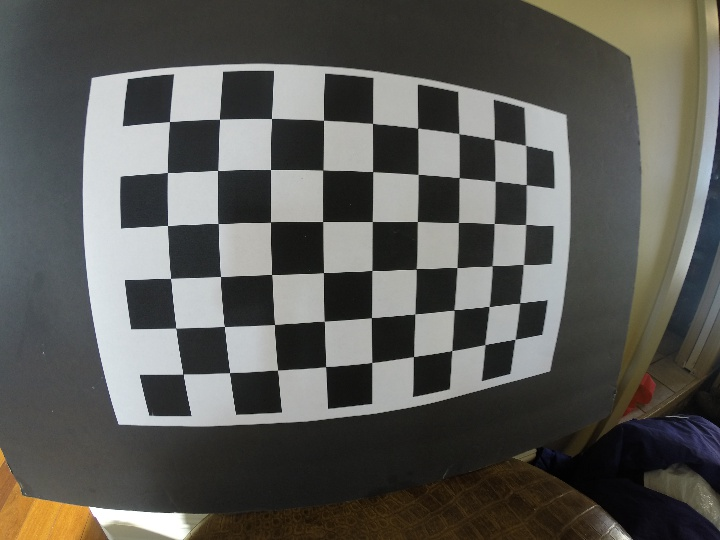
</p>
The code for this step is contained in the first code cell of the IPython notebook located in "./Advanced-Lane_Finging.ipynb".
I am using opencv method. The key idea is using a knowing object, take many pictures from the camera and lens that you want to calibrate. You define the point location, you also need find point location in the picture space. Because of the lens distortion, the points location will not match at this point. Also do this manually is very time consuming and lead to error as well. OpenCV have automatic tools can help. 

I downloaded a 10x7 black and white chessboard from Udacity class for this task. I printed on 11x17 paper and put on flat surface. The chessboard has 9x6 inner corners. The black and white contrast make it easy and reliable detected by opencv. For the code, I start by preparing "object points", which will be the (x, y, z) coordinates of the chessboard inner corners in the world. Here is 9x6, counted by hand. For this project, I am using a flat surface, the z will be always = 0.  Thus, for each test image iteration, the detected corner (x,y) pixel location will be appended to `imgpoint`, and knowning `objp` will be appended into `objpoint`. The process needs 20 - 30 images from different angles and distances to cover the protential usage of the camera. 

Then I can use the output `objpoints` and `imgpoints` to compute the camera calibration and distortion coefficients using the `cv2.calibrateCamera()` function.  I applied this distortion correction to the test image using the `cv2.undistort()` function and obtained this result: 
<p align="center">
 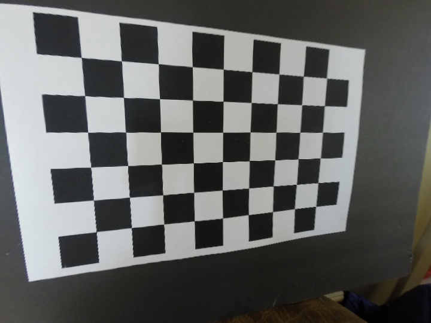
</p>

Then, save the result for future use. 
```
# Save the camera calibration result for later use (we won't worry about rvecs / tvecs)
dist_pickle = {}
dist_pickle["mtx"] = mtx
dist_pickle["dist"] = dist
pickle.dump( dist_pickle, open( "output_images/720x540_pickle.p", "wb" ) )
```

###Pipeline (single images)

####1. Apply distortion-correction to raw image.
To demonstrate this step, I will describe how I apply the distortion correction to one of the test images like this one:
Simply take the saved distortion_correction matrix for the right camera and right resulotion. For speedup the calculation and display, I resized the image to 720x540. All calibration is done on 720 resolution. I forgot change the input image size, it will look like this: 
<p align="center">
 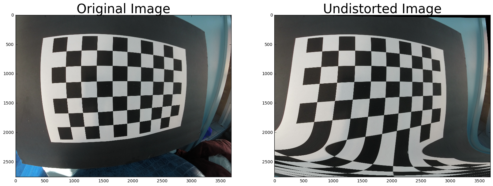
</p>

```
# Read in the saved camera matrix and distortion coefficients
# These are the arrays you calculated using cv2.calibrateCamera()
dist_pickle = pickle.load( open( "output_images/720x540_pickle.p", "rb" ) )
mtx = dist_pickle["mtx"]
dist = dist_pickle["dist"]
```
If do it right, the image will look like this:
<p align="center">
 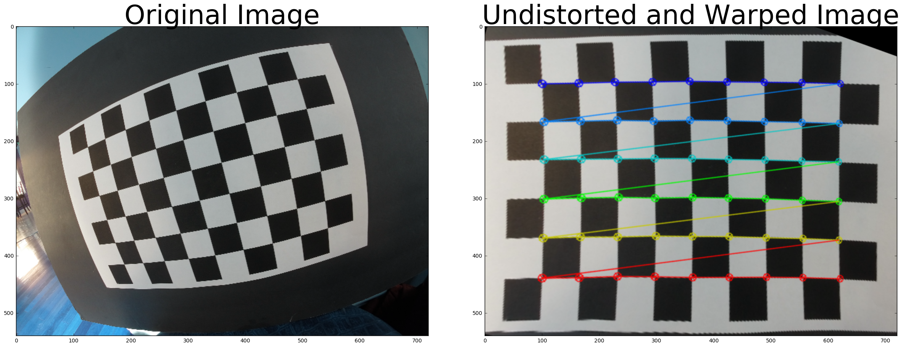
</p>


####2. Describe how (and identify where in your code) you used color transforms, gradients or other methods to create a thresholded binary image.  Provide an example of a binary image result.
I used a combination of color and gradient thresholds to generate a binary image. 
I defined each transform and methods as a function, so I can call them later in the pipeline. 
```
def abs_sobel_thresh(img, orient='x', sobel_kernel=3, thresh=(0,255)):
    # Convert to grayscale
    gray = cv2.cvtColor(img, cv2.COLOR_RGB2GRAY)
    # Apply x or y gradient with the OpenCV Sobel() function
    # and take the absolute value
    if orient == 'x':
        abs_sobel = np.absolute(cv2.Sobel(gray, cv2.CV_64F, 1, 0))
    if orient == 'y':
        abs_sobel = np.absolute(cv2.Sobel(gray, cv2.CV_64F, 0, 1))
    # Rescale back to 8 bit integer
    scaled_sobel = np.uint8(255*abs_sobel/np.max(abs_sobel))
    # Create a copy and apply the threshold
    binary_output = np.zeros_like(scaled_sobel)
    # Here I'm using inclusive (>=, <=) thresholds, but exclusive is ok too
    binary_output[(scaled_sobel >= thresh[0]) & (scaled_sobel <= thresh[1])] = 1

    # Return the result
    return binary_output
```
The sobel x and sobel y behaive totally different, some test images x is better than y, some test is opposite. So I have to use both of them.  
<p align="center">
 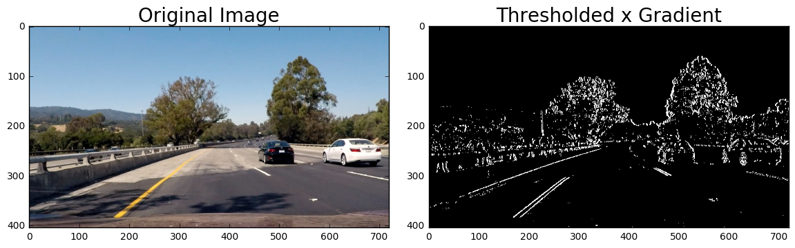
</p>

<p align="center">
 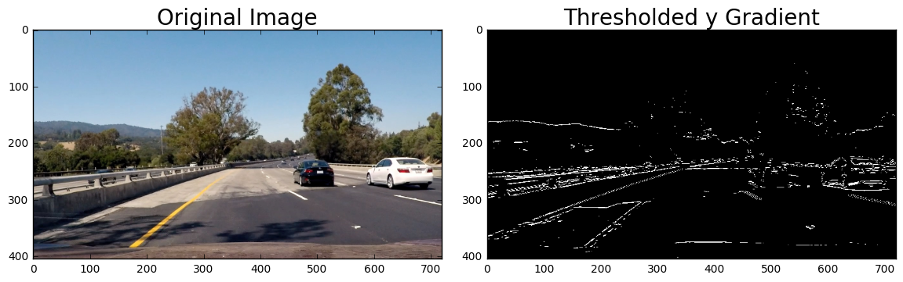
</p>

```
# Define a function to return the magnitude of the gradient
# for a given sobel kernel size and threshold values
def mag_thresh(img, sobel_kernel=3, mag_thresh=(0, 255)):
    # Convert to grayscale
    gray = cv2.cvtColor(img, cv2.COLOR_RGB2GRAY)
    # Take both Sobel x and y gradients
    sobelx = cv2.Sobel(gray, cv2.CV_64F, 1, 0, ksize=sobel_kernel)
    sobely = cv2.Sobel(gray, cv2.CV_64F, 0, 1, ksize=sobel_kernel)
    # Calculate the gradient magnitude
    gradmag = np.sqrt(sobelx**2 + sobely**2)
    # Rescale to 8 bit
    scale_factor = np.max(gradmag)/255 
    gradmag = (gradmag/scale_factor).astype(np.uint8) 
    # Create a binary image of ones where threshold is met, zeros otherwise
    binary_output = np.zeros_like(gradmag)
    binary_output[(gradmag >= mag_thresh[0]) & (gradmag <= mag_thresh[1])] = 1

    # Return the binary image
    return binary_output
```

<p align="center">
 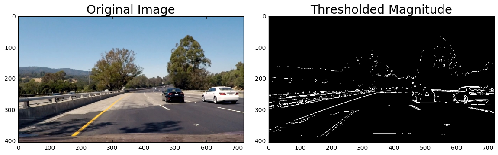
</p>

It looks like Sobel y in this case. 
This is a directional threshold function:
```
# Define a function to threshold an image for a given range and Sobel kernel
def dir_threshold(img, sobel_kernel=3, thresh=(0, np.pi/2)):
    # Grayscale
    gray = cv2.cvtColor(img, cv2.COLOR_RGB2GRAY)
    # Calculate the x and y gradients
    sobelx = cv2.Sobel(gray, cv2.CV_64F, 1, 0, ksize=sobel_kernel)
    sobely = cv2.Sobel(gray, cv2.CV_64F, 0, 1, ksize=sobel_kernel)
    # Take the absolute value of the gradient direction, 
    # apply a threshold, and create a binary image result
    absgraddir = np.arctan2(np.absolute(sobely), np.absolute(sobelx))
    binary_output =  np.zeros_like(absgraddir)
    binary_output[(absgraddir >= thresh[0]) & (absgraddir <= thresh[1])] = 1

    # Return the binary image
    return binary_output
```
<p align="center">
 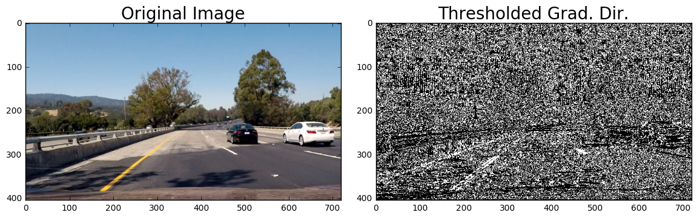
</p>

```
# Define a function that thresholds the S-channel of HLS
def hls_select(img, thresh=(0, 255)):
    hls = cv2.cvtColor(img, cv2.COLOR_RGB2HLS)
    s_channel = hls[:,:,2]
    binary_output = np.zeros_like(s_channel)
    binary_output[(s_channel > thresh[0]) & (s_channel <= thresh[1])] = 1
    return binary_output
```
<p align="center">
 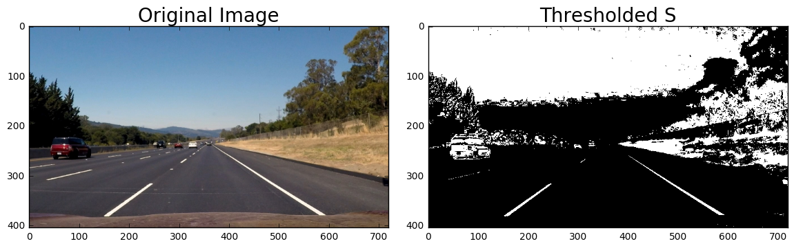
</p>

Combine all thresholds effect together:
```
combined = np.zeros_like(dir_binary)
combined[((gradx == 1) & (grady == 1)) | ((mag_binary == 1) & (dir_binary == 1))] = 1
```
<p align="center">
 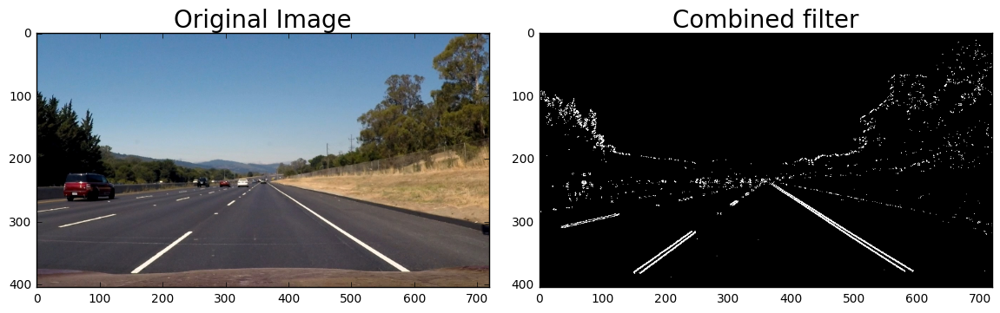
</p>


####3. Describe how (and identify where in your code) you performed a perspective transform and provide an example of a transformed image.

my perspective transform takes raw image (720) and transform matrix M, warp the image to bird view. the code is located in the  code cell of the IPython notebook. 
```
def perspective_transform(img, M):
    warped = cv2.warpPerspective(img, M, dsize = (img.shape[1],img.shape[0]), flags = cv2.INTER_LINEAR)
    return warped

```
The matrix M is generated by `cv2.getPerspectiveTransform(src, dst)`. My approach is defind the apex point first, the polybox is measured left and right offset by 50 pixels. The near bottom of the raw image, I take the offset from outside edge by 10 pixels., 
```
apex, apey = 360, 258
offset_far = 50
offset_near = 10
src = np.float32([[int(apex-offset_far),apey],
                  [int(apex+offset_far),apey],
                  [int(0+offset_near),390],
                  [int(720-offset_near),390]])
dst = np.float32([[0,0],[720,0],[0,405],[720,405]])
M = cv2.getPerspectiveTransform(src, dst)

#Calculate inverted matrix for future use:
Mi = cv2.getPerspectiveTransform(dst, src)

```
I verified that my perspective transform was working as expected for resized images. Load a test image and its warped counterpart to verify that the lane lines appear parallel in the warped image.

<p align="center">
 
</p>

####4. Describe how (and identify where in your code) you identified lane-line pixels and fit their positions with a polynomial?

I sliced the input image into n= 8 bars, each bar, I calculation the histogram and find the two peaks can represent the lane line location. Then save the good location points for left and right lane separely, then feed into a 2nd order polynomial function as showing:
```
from scipy import signal

histogram = np.sum(combined[int(combined.shape[0]*3/8):int(combined.shape[0]*1/2),:], axis=0)
plt.plot(histogram)

peakind = signal.find_peaks_cwt(histogram, np.arange(1,15))
```
<p align="center">
 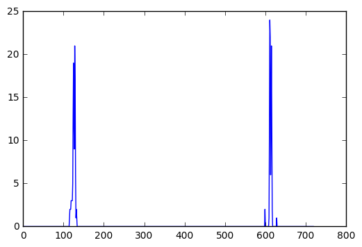
</p>
There are two part of work: 
1. From last n sliced window, we can collect at least 3 good points for left or right lane, for example `lefty` and `leftx` that can fit into `left_fit = np.polyfit(lefty, leftx, 2)`, the output is the A, B, C values for polunomial function f(y)=Ay​2​​+By+C. 
2. Calculate the left_fitx and right_fitx values according to each row in the picture space. `yvals` is an array to match the rows count in pixel/picture space. 

```
yvals = np.linspace(0, img.shape[0], num=img.shape[0])
left_fit = np.polyfit(lefty, leftx, 2)
left_fitx = left_fit[0]*yvals**2 + left_fit[1]*yvals + left_fit[2]
right_fit = np.polyfit(righty, rightx, 2)
right_fitx = right_fit[0]*yvals**2 + right_fit[1]*yvals + right_fit[2]
```
Then plot collected data points as red and blue dots, detected lane show as continuce curve:
<p align="center">
 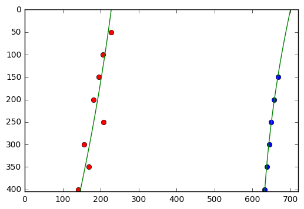
</p>

####5. Describe how you calculated the radius of curvature of the lane and the position of the vehicle with respect to center.

Remember, the "bird_view" in this pipeline is not true bird view. Because of the camera is pointing forward and downward at small angle, in the view, the vertical pixel may repersent 100m and further. The horizotal pixel is repersenting the car width closely. There are the factors I used to convert pixel space to true environment.
```
# Define conversions in x and y from pixels space to meters
ym_per_pix = 30/405 # meters per pixel in y dimension
xm_per_pix = 3.7/600 # meteres per pixel in x dimension
```

Pick a y-value where we want radius of curvature. I choose the maximum y-value, corresponding to the bottom of the image
y_eval = np.max(yvals). Because it is close to the vehical, the curve can reflect the steering angles. 

```
left_fit_cr = np.polyfit(np.array(lefty,dtype=np.float32)*ym_per_pix, \
                         np.array(leftx,dtype=np.float32)*xm_per_pix, 2)
right_fit_cr = np.polyfit(np.array(righty,dtype=np.float32)*ym_per_pix, \
                          np.array(rightx,dtype=np.float32)*xm_per_pix, 2)

def left_curverad(left_fit_cr, y_eval):
    left_curverad = ((1 + (2*left_fit_cr[0]*y_eval + left_fit_cr[1])**2)**1.5) \
                             /np.absolute(2*left_fit_cr[0])
    return left_curverad

def right_curverad(right_fit_cr, y_eval):
    right_curverad = ((1 + (2*right_fit_cr[0]*y_eval + right_fit_cr[1])**2)**1.5) \
                                /np.absolute(2*right_fit_cr[0])
    return right_curverad
```
Next, calculate the camera position relative to lane lines. 
```
#Find camera position relative to lanes
left = np.mean(leftx)
right = np.mean(rightx)
camera = combined.shape[1]/2-np.mean([left, right])
```
<p align="center">
 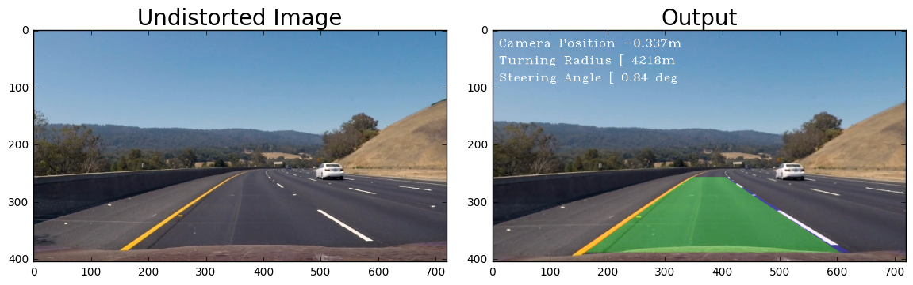
</p>

In above picture, the camera is 0.34mm off to the left. It make sense. 

Also, I implement a 3 point circle detector, take 3 points from the curve above, calculate the turning radius and steering angle. 
```
def find_3p_circle_radius(x1,y1,x2,y2,x3,y3):
    
    # source : http://www.intmath.com/applications-differentiation/8-radius-curvature.php
    m1 = (y2-y1)/(x2-x1)
    m2 = (y3-y2)/(x3-x2)
    
    xc = (m1*m2*(y1-y3)+m2*(x1+x2)-m1*(x2+x3))/(2*(m2-m1))
    yc = -(xc-(x1+x2)/2)/m1+(y1+y2)/2
    
    Radius = np.sqrt((x2-xc)*(x2-xc)+(y2-yc)*(y2-yc))
    
    return m1, m2, xc, yc, Radius
```

####6. Provide an example image of your result plotted back down onto the road such that the lane area is identified clearly.

<p align="center">
 
</p>

There are two steps to do this task:
1. Create a blank image warp_zero, same size as latest one in the pipeline. Use `cv2.fillPoly()` to draw the closed area and curverad information and Camera Position:
```
# Draw the lane onto the warped blank image
warp_zero = np.zeros_like(warped).astype(np.uint8)
cv2.fillPoly(warp_zero, pts, (0,255, 0))
cv2.polylines(warp_zero, np.array([pts_left], dtype=np.int32), False,(255,0,0),thickness = 20)
cv2.polylines(warp_zero, np.array([pts_right], dtype=np.int32), False,(0,0,255),thickness = 20)
font = cv2.FONT_HERSHEY_SIMPLEX
cv2.putText(img,'Left curverad' + ' ' + str(left_curverad) + 'm',(10,90), font, 1,(255,255,255),1)
cv2.putText(img,'Right curverad' + ' ' + str(right_curverad) + 'm',(10,60), font, 1,(255,255,255),1)
cv2.putText(img,'Camera Position' + ' ' + str(camera*xm_per_pix) + 'm',(10,30), font, 1,(255,255,255),1)
```
2. Use inverted perspective transform matrix and `cv2.warpPerspective(warp_zero, Mi, (img.shape[1], img.shape[0]))` to  transform the filled polylines to the ground. Then merge the projection with original image.
```
Mi = cv2.getPerspectiveTransform(dst, src)
unwarp = cv2.warpPerspective(warp_zero, Mi, (img.shape[1], img.shape[0])) 

# Combine the result with the original image
result = cv2.addWeighted(img, 1, unwarp, 0.3, 0)
result = cv2.resize(result, (720, 405))
```
The image processing pipeline is finished here. 

###Pipeline (video)

####1. Provide a link to your final video output.  Your pipeline should perform reasonably well on the entire project video (wobbly lines are ok but no catastrophic failures that would cause the car to drive off the road!).

Here's a [link to my video result for project video](https://www.youtube.com/watch?v=oULk7j1S5Uw)
Here's a [link to the similar video, with meaningful driving infomation](https://youtu.be/LrrwUhCorGY)

Here's a [link to my video result for challenge video](https://www.youtube.com/watch?v=bs7Fg1PitH0)

Here's a [link to my video result for harder challenge video](https://www.youtube.com/watch?v=xS1bxCb0AAM)


###Discussion

####1. Briefly discuss any problems / issues you faced in your implementation of this project.  Where will your pipeline likely fail?  What could you do to make it more robust?

*No 1, the speed is a concern. I know the canny edge detector is low cost, high speed detector. But Hough transform is resource heavy one. And this project I am using lot of transforms one after one. In first attempt, I used scipy  `signal.find_peaks_cwt(histogram, np.arange(1,15))`, the whole pipeline went through 1200~ resized images (720x405) for 7 minutes, it is about 2.8fps, too slow for real time application. Second attempt, I used Udacity sliding window detector, other transforms keep the same, the speed went up, it only took 2 minutes to finish 1261 images. It is about 10 fps, it can be useful for real time detection. I also checked the CPU usage, the second attempt used more CPU power, at 40% level, the first attempt only use 20% level. 

*No 2, tuning the threshholds for each transform is time consuming work. One setting may work for one picture but not work for other pictures. The robotic approach pipeline can handle the project video. But it has some difficulty to handle challenge video. And completely fail on the harder challenge. Based on Behavioral-Cloning project experience, I feel the challenge video is not a challenge for deep network at all. 

*No 3, display bug. I tried few options, the turning radius and steering angle still show unwanted '[', I don't know where it come from.  
####2. Future Work
In this project, I didn't use moving average, smoothing technique, remember the previous frame at all, there are lot of room for improvement. 
*1. Reduce the picture size that go through the pipeline to gain more fps. Some student are talk about scale by 1/4, from 1280*720 image. I will try 200x66. If it works for neural network, it may work for robotic vision. 
*2. Add Neural network to the system. Neural network use GPU, robotic vision use CPU, get benefit from both.
*3. Keep tracking the defined lanes. The curve would not change suddenly, event you lose a few frames of image stream. Maybe can save and moving average the lane data points, or fitted curves, or even average the polylines. I think save more lane data points, extend the bird view area, to make it 3 pictures long or 5 pictures long is doable. 
*4. Maybe can fit to a circle formular, rather than polunomial function, and find the center point of that circle. 

###Acknowledgements

Almost the entire project is based on Udacity teaching material. There are few additional resource found in:
http://www.intmath.com/applications-differentiation/8-radius-curvature.php
and inspired by slack channels and github.com. 
